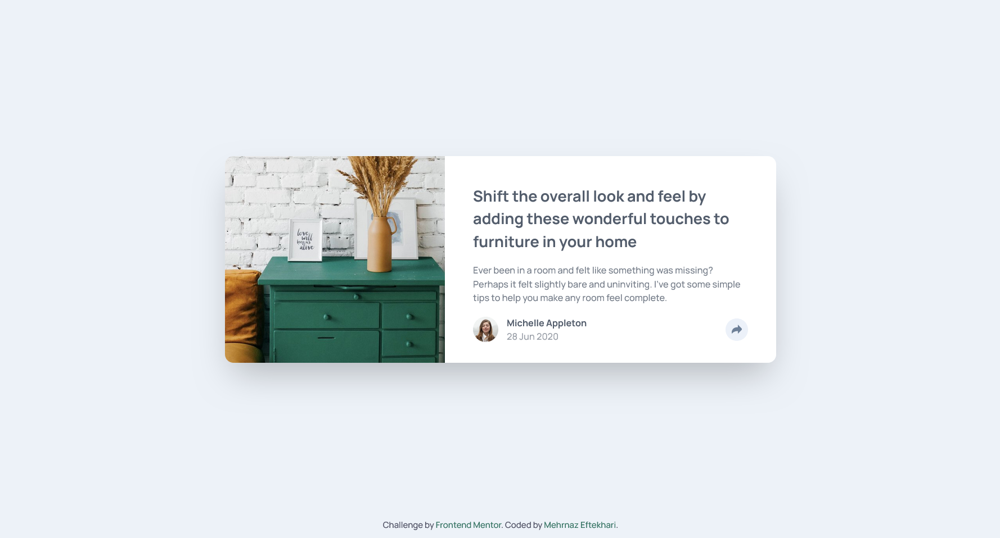
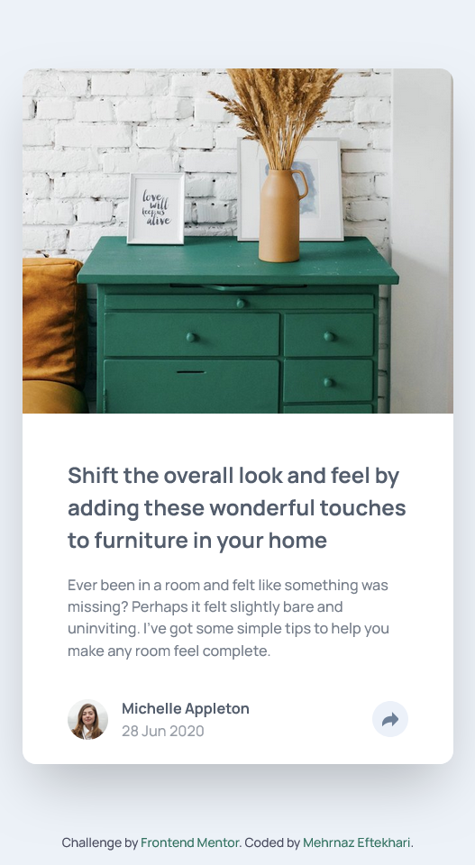

# Frontend Mentor - Article Preview Component Solution

This is a solution to the [Article Preview Component challenge on Frontend Mentor](https://www.frontendmentor.io/challenges/article-preview-component-dYBN_pYFT). Frontend Mentor challenges help you improve your coding skills by building realistic projects.

## Table of Contents

- [Overview](#overview)
  - [The Challenge](#the-challenge)
  - [Screenshots](#screenshots)
  - [Links](#links)
- [My Process](#my-process)
  - [Built With](#built-with)
  - [What I Learned](#what-i-learned)
  - [Continued Development](#continued-development)
  - [Useful Resources](#useful-resources)
  - [Color Palette](#color-palette)
  - [Fonts](#fonts)
- [Author](#author)
- [Acknowledgments](#acknowledgments)

## Overview

### The Challenge

Users should be able to:

- View the optimal layout for the component depending on their device's screen size.
- Toggle the share options visibility by clicking the share button.

### Screenshots

### Links

- Solution URL: [View on GitHub](https://github.com/mehrnaz98/article-preview-component.git)
- Live Site URL: [View on Netlify](https://chic-cupcake-754978.netlify.app/)

## My Process

### Built With

- Semantic HTML5 markup
- CSS Flexbox for layout
- Tailwind CSS for styling
- JavaScript for toggling share options

### What I Learned

This project helped me improve my skills in responsive design using Flexbox and Tailwind CSS. I also practiced adding interactivity with JavaScript by implementing a toggle function for the share options.

### Continued Development

I plan to further develop my skills in interactive components using JavaScript and explore more complex layout techniques with Tailwind CSS.

### Useful Resources

- [Tailwind CSS Documentation](https://tailwindcss.com/docs) - Helped me understand Tailwind CSS utility classes.
- [MDN Web Docs on JavaScript](https://developer.mozilla.org/en-US/docs/Web/JavaScript) - A great reference for JavaScript functionality.

### Color Palette

#### Primary

- Dark Grayish Blue: hsl(217, 19%, 35%)
- Desaturated Dark Blue: hsl(214, 17%, 51%)

#### Neutral

- Grayish Blue: hsl(212, 23%, 69%)
- Light Grayish Blue: hsl(210, 46%, 95%)

### Fonts

- Family: [Manrope](https://fonts.google.com/specimen/Manrope)
- Weights: 500, 700

## Author

- GitHub - [mehrnaz98](https://github.com/mehrnaz98)
- Frontend Mentor - [mehrnaz98](https://www.frontendmentor.io/profile/mehrnaz98)

## Acknowledgments

A special thanks to the Frontend Mentor community for the challenge and inspiration.
